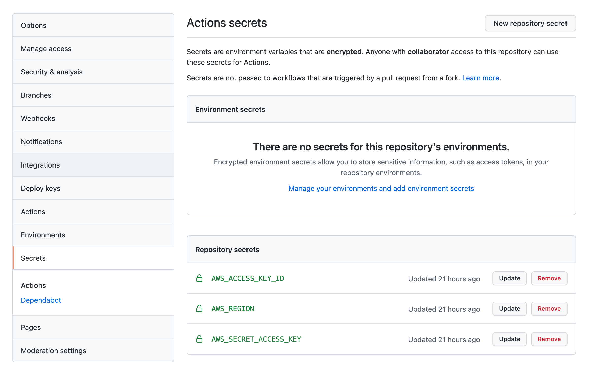
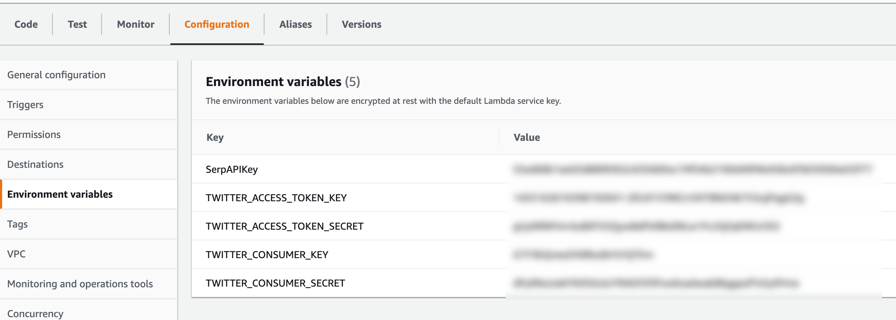

# cincyeventbot

# Twitter
https://twitter.com/CincyEventBot

# Want to set up your own event bot?
1. get an API key from https://serpapi.com/
2. create a twitter app and get: 
   1. Consumer Key & Consumer Secret
   2. Access Key & Access Secret
3. [use appleboy/lambda-action@master to deploy to AWS Lambda](./.github/workflows/main.yml)
   1. and add AWS access keys to your Github Repo
   
4. put the keys & secrets from above in your Lambda configuration
   
5. set up a timer trigger via AWS EventBridge (CloudWatch Events)